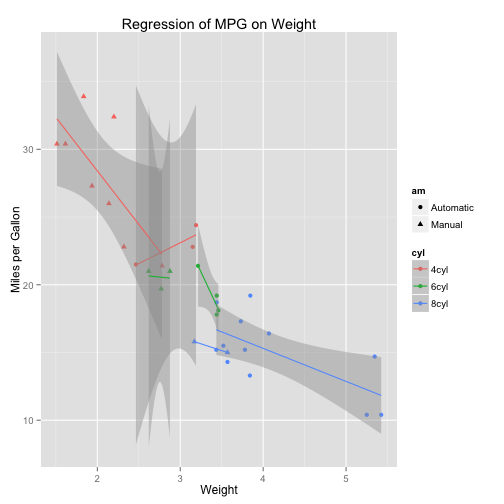

# Motor Trend, a magazine about the automobile industry. 

### Problem

Looking at a data set of a collection of cars, interested in exploring the relationship between a set of variables and miles per gallon (MPG) (outcome variable). 

They are particularly interested in the following two questions

- “Is an automatic or manual transmission better for MPG”

- "Quantify the MPG difference between automatic and manual transmissions"

### Data

First mtcars data set is loaded at start from R base

### Analysis 

#### Exploration 


First we clean and preparate the data

```r
library(ggplot2)
library(corrplot)

mtcars2<-mtcars

#factor labeling
mtcars$gear <- factor(mtcars$gear,levels=c(3,4,5),
  	labels=c("3gears","4gears","5gears")) 
mtcars$am <- factor(mtcars$am,levels=c(0,1),
  	labels=c("Automatic","Manual")) 
mtcars$cyl <- factor(mtcars$cyl,levels=c(4,6,8),
   labels=c("4cyl","6cyl","8cyl")) 

summary(mtcars)
```

```
##       mpg         cyl          disp             hp             drat     
##  Min.   :10.4   4cyl:11   Min.   : 71.1   Min.   : 52.0   Min.   :2.76  
##  1st Qu.:15.4   6cyl: 7   1st Qu.:120.8   1st Qu.: 96.5   1st Qu.:3.08  
##  Median :19.2   8cyl:14   Median :196.3   Median :123.0   Median :3.69  
##  Mean   :20.1             Mean   :230.7   Mean   :146.7   Mean   :3.60  
##  3rd Qu.:22.8             3rd Qu.:326.0   3rd Qu.:180.0   3rd Qu.:3.92  
##  Max.   :33.9             Max.   :472.0   Max.   :335.0   Max.   :4.93  
##        wt            qsec            vs                am         gear   
##  Min.   :1.51   Min.   :14.5   Min.   :0.000   Automatic:19   3gears:15  
##  1st Qu.:2.58   1st Qu.:16.9   1st Qu.:0.000   Manual   :13   4gears:12  
##  Median :3.33   Median :17.7   Median :0.000                  5gears: 5  
##  Mean   :3.22   Mean   :17.8   Mean   :0.438                             
##  3rd Qu.:3.61   3rd Qu.:18.9   3rd Qu.:1.000                             
##  Max.   :5.42   Max.   :22.9   Max.   :1.000                             
##       carb     
##  Min.   :1.00  
##  1st Qu.:2.00  
##  Median :2.00  
##  Mean   :2.81  
##  3rd Qu.:4.00  
##  Max.   :8.00
```

Figure number 2 shows the distribution of miles per galon in relation with horsepower, cylinders, gears and transmission. 
The plot shows a concentration over the upper left corner for 4 cyl where manual is the major part focusing around 27, while in 8 cyl and 3gears the automatic type is clustered around 15 miles. 


```r
#mpg vs hp with transmission, facet cyl vs gear

qplot(hp, mpg, data=mtcars, shape=am, color=am, 
   facets=gear~cyl, size=I(3),
   xlab="Horsepower", ylab="Miles per Gallon") 
```

 


The next plot shows a basic exploratory analysis in terms of correlation matrix, where can be seen that mpg is strongly related to cyl, disp, hp and wt.

```r
cor_plot<-corrplot.mixed(cor(mtcars2))
```

 


#### Regression 
In the next plot it is done a piecewise  regression by type and some relations are contrasted.

```r
# Separate regressions of mpg on weight for each number of cylinders and transmission
qplot(wt, mpg, data=mtcars, geom=c("point", "smooth"), 
   method="lm", formula=y~x, color=cyl,shape=am, 
   main="Regression of MPG on Weight", 
   xlab="Weight", ylab="Miles per Gallon")
```

 

Next 3 models are done: one only with am variables, another with all variables and a lastone with step wise selection for predictors.

```
## 
## Call:
## lm(formula = mpg ~ am, data = mtcars)
## 
## Residuals:
##    Min     1Q Median     3Q    Max 
## -9.392 -3.092 -0.297  3.244  9.508 
## 
## Coefficients:
##             Estimate Std. Error t value Pr(>|t|)    
## (Intercept)    17.15       1.12   15.25  1.1e-15 ***
## amManual        7.24       1.76    4.11  0.00029 ***
## ---
## Signif. codes:  0 '***' 0.001 '**' 0.01 '*' 0.05 '.' 0.1 ' ' 1
## 
## Residual standard error: 4.9 on 30 degrees of freedom
## Multiple R-squared:  0.36,	Adjusted R-squared:  0.338 
## F-statistic: 16.9 on 1 and 30 DF,  p-value: 0.000285
```

```
## 
## Call:
## lm(formula = mpg ~ ., data = mtcars)
## 
## Residuals:
##    Min     1Q Median     3Q    Max 
## -3.202 -1.232  0.103  1.195  4.308 
## 
## Coefficients:
##             Estimate Std. Error t value Pr(>|t|)  
## (Intercept)  15.0926    17.1363    0.88    0.389  
## cyl6cyl      -1.1994     2.3874   -0.50    0.621  
## cyl8cyl       3.0549     4.8299    0.63    0.535  
## disp          0.0126     0.0177    0.71    0.487  
## hp           -0.0571     0.0317   -1.80    0.088 .
## drat          0.7358     1.9846    0.37    0.715  
## wt           -3.5451     1.9090   -1.86    0.079 .
## qsec          0.7680     0.7522    1.02    0.320  
## vs            2.4885     2.5401    0.98    0.340  
## amManual      3.3474     2.2895    1.46    0.160  
## gear4gears   -0.9992     2.9466   -0.34    0.738  
## gear5gears    1.0645     3.0273    0.35    0.729  
## carb          0.7870     1.0360    0.76    0.457  
## ---
## Signif. codes:  0 '***' 0.001 '**' 0.01 '*' 0.05 '.' 0.1 ' ' 1
## 
## Residual standard error: 2.62 on 19 degrees of freedom
## Multiple R-squared:  0.885,	Adjusted R-squared:  0.812 
## F-statistic: 12.1 on 12 and 19 DF,  p-value: 1.76e-06
```

```
## 
## Call:
## lm(formula = mpg ~ wt + qsec + am, data = mtcars)
## 
## Residuals:
##    Min     1Q Median     3Q    Max 
## -3.481 -1.556 -0.726  1.411  4.661 
## 
## Coefficients:
##             Estimate Std. Error t value Pr(>|t|)    
## (Intercept)    9.618      6.960    1.38  0.17792    
## wt            -3.917      0.711   -5.51    7e-06 ***
## qsec           1.226      0.289    4.25  0.00022 ***
## amManual       2.936      1.411    2.08  0.04672 *  
## ---
## Signif. codes:  0 '***' 0.001 '**' 0.01 '*' 0.05 '.' 0.1 ' ' 1
## 
## Residual standard error: 2.46 on 28 degrees of freedom
## Multiple R-squared:  0.85,	Adjusted R-squared:  0.834 
## F-statistic: 52.7 on 3 and 28 DF,  p-value: 1.21e-11
```

```
## Analysis of Variance Table
## 
## Model 1: mpg ~ am
## Model 2: mpg ~ wt + qsec + am
## Model 3: mpg ~ cyl + disp + hp + drat + wt + qsec + vs + am + gear + carb
##   Res.Df RSS Df Sum of Sq     F  Pr(>F)    
## 1     30 721                               
## 2     28 169  2       552 40.29 1.5e-07 ***
## 3     19 130  9        39  0.64    0.75    
## ---
## Signif. codes:  0 '***' 0.001 '**' 0.01 '*' 0.05 '.' 0.1 ' ' 1
```
As can be observed the anova results indicate that the step wise model has a better performance. 
The figure number 4 show the basic plots for a regression fit. The one on residuals and q-q plot show that residuals have a very-close-to normal distribution.   


```r
par(mfrow=c(2,2))
# Reg plots
plot(step_model)
```

 

For testing the global effect of transmission type over mpg hypothesis testing is done.


```
## 
## 	F test to compare two variances
## 
## data:  auto and man
## F = 0.3866, num df = 18, denom df = 12, p-value = 0.06691
## alternative hypothesis: true ratio of variances is not equal to 1
## 95 percent confidence interval:
##  0.1244 1.0703
## sample estimates:
## ratio of variances 
##             0.3866
```

```
## 
## 	Welch Two Sample t-test
## 
## data:  mpg by am
## t = -3.767, df = 18.33, p-value = 0.001374
## alternative hypothesis: true difference in means is not equal to 0
## 95 percent confidence interval:
##  -11.28  -3.21
## sample estimates:
## mean in group Automatic    mean in group Manual 
##                   17.15                   24.39
```
