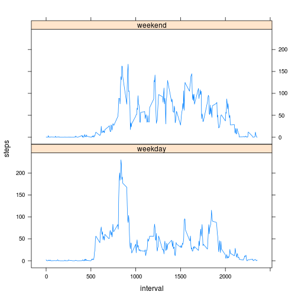

## Loading and preprocessing the data

```r
	library(reshape2)
	library(ggplot2)
    data_init<-read.csv("activity.csv")
    data_init$date<-as.Date(data_init$date)
    data<-data.frame(data_init[!is.na(data_init$steps),])
	daily_total_steps <- ddply(data, .(date), summarise, total_steps=sum(steps))
```

       
## What is mean total number of steps taken per day?

```r
    #Histogram
    hist(daily_total_steps$total_steps, xlab="total number of steps per day") 
```

 

```r
    # mean and median 
    #print("Mean and Median")
	mean(daily_total_steps$total_steps)
```

```
## [1] 10766.19
```

```r
	median(daily_total_steps$total_steps)
```

```
## [1] 10765
```


## What is the average daily activity pattern?

```r
	average_by_date <- ddply(data, .(interval), summarise, mean_daily_steps=mean(steps))
	plot(average_by_date$interval, average_by_date$mean_daily_steps, type="l", xlab="5-minute interval", 
	ylab="mean_daily_steps",main="Average daily activity pattern")
```

 

```r
	# Which 5-minute interval, on average across all the days in the dataset, contains the maximum number of steps?
	average_by_date[average_by_date$mean_daily_steps==max(average_by_date$mean_daily_steps),]
```

```
##     interval mean_daily_steps
## 104      835         206.1698
```

```r
	colnames(average_by_date)[2] <- "interval_average"
```

## Imputing missing values

```r
    #  Missing values
	print("Missing Values")
```

```
## [1] "Missing Values"
```

```r
	sum(is.na(data_init$steps))
```

```
## [1] 2304
```

```r
	# Imputing NA's with average on 5-min interval
	merged_data <- arrange(join(data_init, average_by_date), interval) 
```

```
## Joining by: interval
```

```r
	merged_data$steps[is.na(merged_data$steps)] <- merged_data$interval_average[is.na(merged_data$steps)]
	
	# Histogram
	imputed_data <- ddply(merged_data, .(date), summarise, steps=sum(steps))
	hist(imputed_data$steps, main="Number of Steps", 
     xlab="Steps per day",)
```

 

```r
	# Mean and Median statistics don't change significantly
	mean(imputed_data$steps)
```

```
## [1] 10766.19
```

```r
	median(imputed_data$steps)
```

```
## [1] 10766.19
```

```r
	steps_1 <- sum(data$steps)
	steps_2 <- sum(merged_data$steps)
	steps_2-steps_1
```

```
## [1] 86129.51
```


## Are there differences in activity patterns between weekdays and weekends?

```r
	library(lattice)
	weekdays <- weekdays(as.Date(merged_data$date))
	data_week <- transform(merged_data, day=weekdays)
	data_week$wk <- ifelse(data_week$day %in% c("Saturday", "Sunday"),"weekend", "weekday")
	week_avg <- ddply(data_week, .(interval, wk), summarise, steps=mean(steps))

	xyplot(steps ~ interval | wk, data = week_avg, layout = c(1, 2), type="l")
```

 
